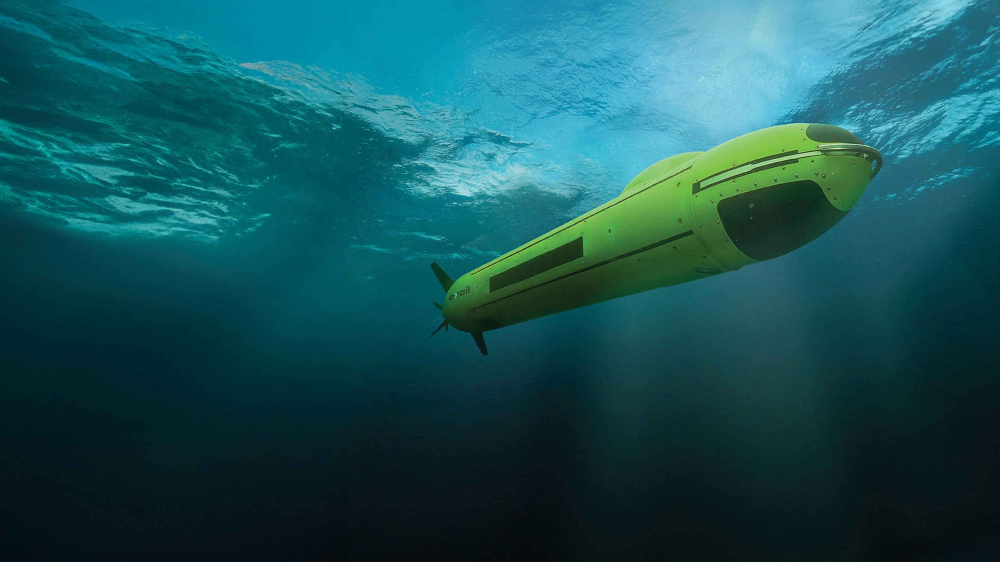

# Deep-Sea Exploration Technology

Exploring the **deepest parts of the ocean** — places of extreme pressure and darkness — requires **powerful and intelligent machines**.  
Engineers have developed **submersibles** and **robots** to withstand these harsh conditions and help us unlock ocean mysteries.

## Manned Submersibles

**Manned submersibles** are small submarines designed to carry a crew to the ocean floor, built to withstand the extreme pressure of deep-sea environments. Their strong shells, usually made of thick steel or titanium, protect humans from crushing forces, while onboard systems like ballast tanks, thrusters, and life-support units allow the submersible to dive, navigate, and sustain the crew safely. These vehicles are essential for direct observation, sample collection, and conducting experiments in areas that are otherwise unreachable.

##  Remotely Operated Vehicles (ROVs)

ROVs are unmanned, cable-connected robots that transmit power and data between the surface ship and the vehicle. They are equipped with manipulator arms, high-resolution cameras, and sonar systems, enabling researchers to perform complex tasks like collecting samples, inspecting underwater structures, and mapping the seafloor without putting humans at risk. Their long operational endurance and precision make them a critical tool for scientific exploration, maintenance, and deep-sea construction.

> 💡 *ROVs act as the “eyes and hands” of scientists deep underwater.*

##  Autonomous Underwater Vehicles (AUVs)

AUVs are self-operating robots that follow pre-programmed paths, ideal for surveying large areas of the ocean independently. They use acoustic communication to transmit data, inertial navigation for precise movement, and long-lasting batteries to carry out extended missions. AUVs are particularly effective for detailed mapping, environmental monitoring, and studying regions where tethered operation is impractical, complementing both manned submersibles and ROVs in modern ocean exploration.

](https://github.com/SevanthiBR/Images/blob/main/AUV.jpg?raw=true)

##  Conclusion

Together, manned submersibles, ROVs, and AUVs form the backbone of modern ocean exploration.  
They allow us to safely study the deep sea and uncover its hidden mysteries without exposing humans to its dangers.  
